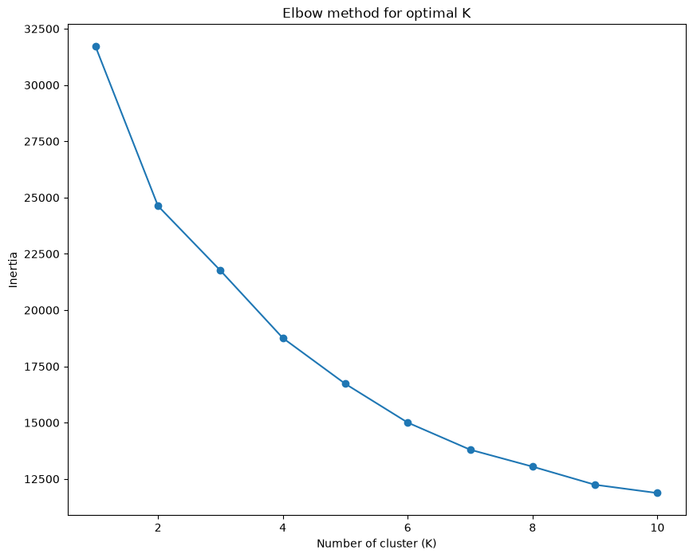
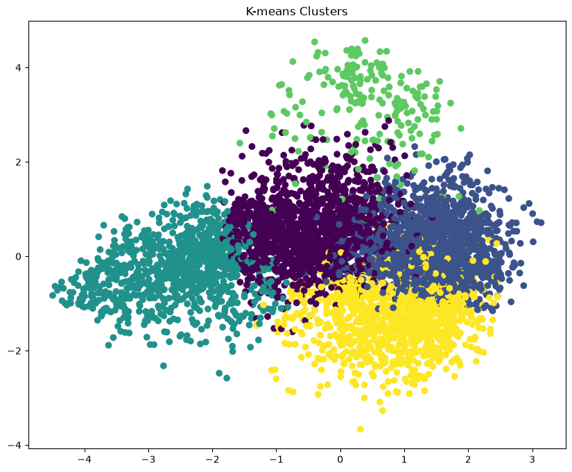

# 🎵 Spotify Song Recommendation System

<div align="center">


### 🎧 Discover Similar Songs Using Machine Learning

</div>

---

# 📖 Introduction

The **Spotify Song Recommendation System** is a Machine Learning-based application that recommends songs similar to a user's selected song by analyzing Spotify audio features.

Instead of relying only on genres or artists, the system uses **K-Means Clustering** and **Cosine Similarity** to identify songs with similar musical characteristics.

The project also includes a **Flask Web Application** that allows users to interact with the recommendation engine through a simple and attractive user interface.

---

# 🎯 Problem Statement

With millions of songs available on streaming platforms, users often struggle to discover songs that match their musical preferences.

Traditional recommendation methods based only on artists or genres may not accurately capture the actual similarity between songs.

This project aims to:

- 🎵 Recommend songs with similar audio characteristics.
- 🤖 Apply Machine Learning algorithms for intelligent recommendations.
- 📊 Analyze Spotify audio features.
- 🌐 Provide recommendations through a Flask web application.

---

# 📂 Dataset Description

| 📌 Attribute | 📄 Details |
|--------------|------------|
| **Dataset Name** | Spotify Tracks Dataset |
| **Source** | Kaggle |
| **File Format** | CSV (.csv) |
| **Dataset Link** | https://www.kaggle.com/datasets/vatsalmavani/spotify-dataset
| **Purpose** | To build a Machine Learning model capable of recommending similar songs based on Spotify audio features. |

---

## 🎼 Features Used

- 🎤 Artist
- 🎵 Song Name
- 💃 Danceability
- ⚡ Energy
- 😊 Valence
- 🎼 Tempo
- 🎧 Acousticness
- 🎙 Speechiness
- 🎹 Instrumentalness
- 👥 Liveness

---

# 🧹 1. Data Cleaning

The dataset was preprocessed before training the Machine Learning model.

### ✔ Steps Performed

- Imported dataset using Pandas
- Checked missing values
- Removed duplicate records
- Removed unnecessary columns
- Selected useful audio features
- Verified data types
- Saved cleaned dataset

---

# 📊 2. Exploratory Data Analysis (EDA)

EDA was performed to understand the dataset and identify important patterns.

### ✔ Analysis Performed

- Summary Statistics
- Feature Distribution
- Correlation Analysis
- Histogram
- Scatter Plot
- Audio Feature Comparison

---

# 🤖 3. Machine Learning Model Development

The recommendation engine combines **K-Means Clustering** and **Cosine Similarity**.
<p>
The recommendation engine was developed using the <strong>K-Means Clustering</strong> algorithm and
<strong>Cosine Similarity</strong>. K-Means groups songs with similar audio characteristics into
clusters, while Cosine Similarity identifies the most similar songs within the selected cluster.
This approach improves recommendation accuracy and reduces computational complexity.
</p>

---

## 📈 Elbow Method

<p>
Before applying K-Means clustering, the <strong>Elbow Method</strong> was used to determine the
optimal number of clusters (<strong>K</strong>). The method plots the
<strong>Within-Cluster Sum of Squares (WCSS)</strong> against different values of K.
The point where the graph forms an "elbow" indicates the most suitable number of clusters,
where increasing the number of clusters provides only a small improvement in reducing WCSS.
</p>
The Elbow Method was used to determine the optimal number of clusters.

<p align="center">

</p>

---

## 🎯 K-Means Clustering

<p>
After selecting the optimal value of K using the Elbow Method, the K-Means algorithm was applied
to group songs with similar audio features. Since the dataset contains multiple dimensions,
<strong>Principal Component Analysis (PCA)</strong> was used to reduce the data into two dimensions
for visualization. Each color in the graph represents a different cluster, while the red
centroids indicate the center of each cluster.
</p>
<p align="center">

</p>

---

## ⭐ Silhouette Score

<p>
The quality of clustering was evaluated using the <strong>Silhouette Score</strong>. This metric
measures how similar an object is to its own cluster compared to other clusters.
The Silhouette Score ranges from <strong>-1 to +1</strong>, where:
</p>

<ul>
    <li><strong>+1:</strong> Excellent clustering with well-separated clusters.</li>
    <li><strong>0:</strong> Overlapping clusters.</li>
    <li><strong>-1:</strong> Incorrect clustering.</li>
</ul>

<p>
The Silhouette Score obtained for this project is:
</p>

<div style="background:#f4f4f4; padding:15px; border-left:5px solid #1DB954; font-size:18px;">
    <strong>Silhouette Score = 0.48</strong>
</div>

<p>
A Silhouette Score of <strong>0.48</strong> indicates that the songs are reasonably well grouped
into clusters, making the recommendation system effective for finding musically similar songs.
</p>

---

## 🎼 Recommendation Workflow

```text
Select Song
      │
      ▼
Find Cluster
      │
      ▼
Cosine Similarity
      │
      ▼
Recommend Top 5 Similar Songs
```
<ol>
    <li>User selects a song from the web application.</li>
    <li>The system identifies the cluster to which the song belongs.</li>
    <li>All songs within the same cluster are retrieved.</li>
    <li>Cosine Similarity is calculated between the selected song and the remaining songs.</li>
    <li>The top five most similar songs are recommended to the user.</li>
</ol>
---

# 🌐 4. Flask Web Application

The recommendation model was deployed using **Flask**.

### ✨ Features

- 🎵 Song Selection Dropdown
- 🎧 Top 5 Song Recommendations
- 🎤 Artist Names
- 💻 Responsive UI
- ⚡ Fast Recommendation Engine

---

# 🛠️ Technologies Used

### 👨‍💻 Programming Language

- Python

### 📚 Libraries

- Pandas
- NumPy
- Scikit-learn
- Flask
- Matplotlib
- Seaborn

### 🎨 Frontend

- HTML5
- CSS3

### 🤖 Machine Learning

- K-Means Clustering
- Cosine Similarity
- PCA (Principal Component Analysis)

---

# 📁 Project Structure

```text
Spotify-Song-Recommendation-System/

│── Data_Cleaning.ipynb
│── model.ipynb
│── app.py
│── clustered_df.csv
│── README.md
│
├── templates/
│      └── index.html
│
├── static/
│      └── style.css
│
├── images/
│      ├── elbow_method.png
│      ├── kmeans_clusters.png

---

# 🚀 Future Scope

- 🎧 Spotify API Integration
- 🎨 Album Artwork
- 🎵 Song Preview
- 😊 Mood-Based Recommendation
- 📃 Playlist Recommendation
- 🔐 User Authentication
- 🤖 Deep Learning Recommendation System

---

# ✅ Conclusion

The **Spotify Song Recommendation System** successfully demonstrates how **Machine Learning**, **Data Analysis**, and **Web Development** can be combined to build an intelligent music recommendation platform.

Using **K-Means Clustering** and **Cosine Similarity**, the system groups songs with similar audio characteristics and provides personalized recommendations through a user-friendly Flask web application.

This project showcases the complete Machine Learning pipeline, including **data preprocessing, exploratory data analysis, clustering, recommendation generation, evaluation, and deployment**.

---

# 👩‍💻 Author

## **Archita Singh**
